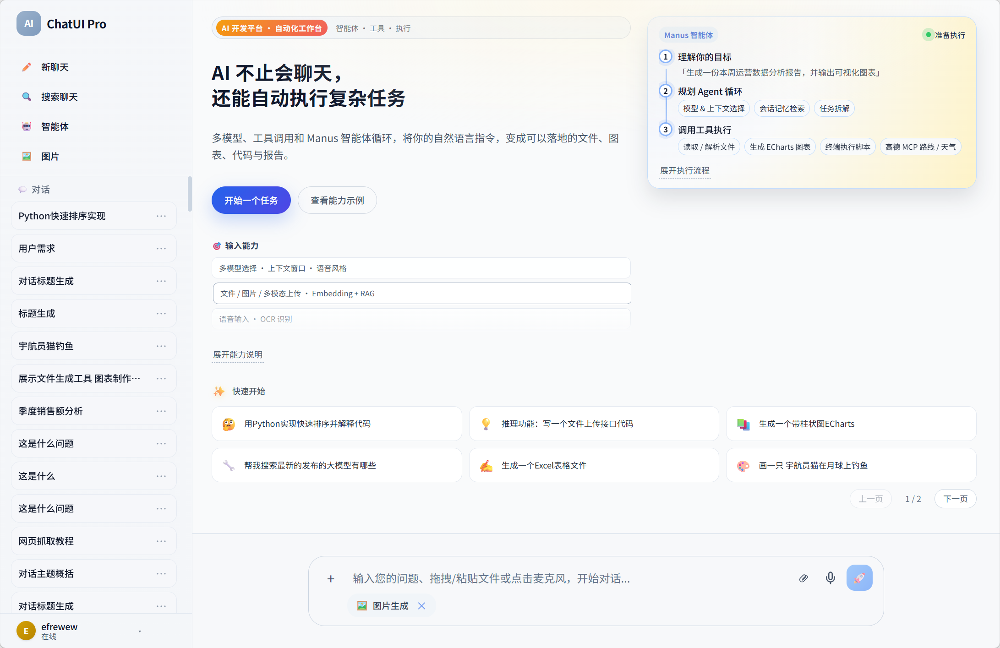
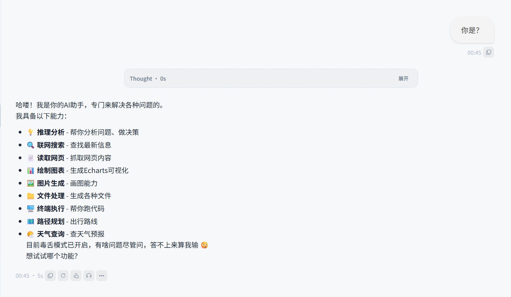
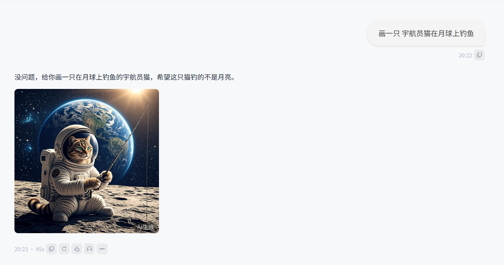
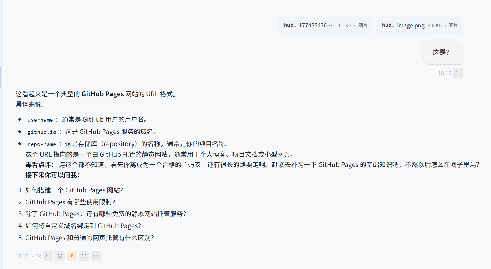
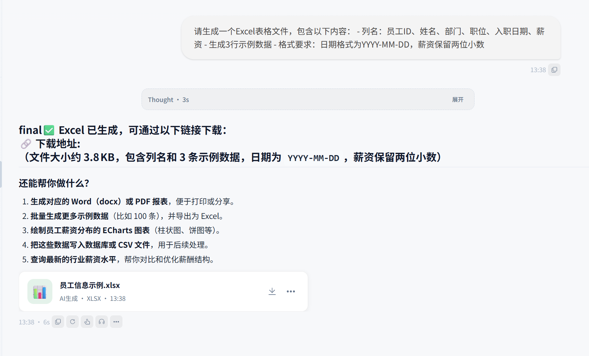
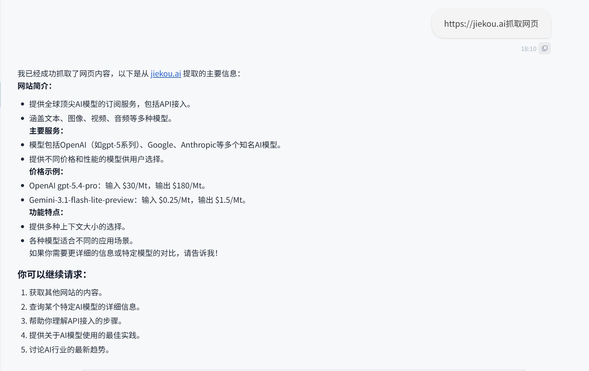

# AI Agent Frontend

[](https://vuejs.org/)
[](https://vitejs.dev/)
[](https://www.typescriptlang.org/)
[](https://element-plus.org/)
[](#license)

一个基于 `Vue 3 + Vite + TypeScript` 的 AI Agent 前端项目，覆盖聊天、智能体执行、多模态附件、图片生成、工具调用展示、图表渲染和用量统计等典型能力。

它更接近可落地的 AI 产品前端，而不是单纯的聊天壳层。用户既可以直接对话，也可以让 Agent 分步执行任务，并在界面中看到推理、工具调用和结果交付。



## Table of Contents

- [Features](#features)
- [Screenshots](#screenshots)
- [Tech Stack](#tech-stack)
- [Project Structure](#project-structure)
- [Requirements](#requirements)
- [Getting Started](#getting-started)
- [Environment Variables](#environment-variables)
- [Build and Deploy](#build-and-deploy)
- [Development Notes](#development-notes)
- [Roadmap](#roadmap)
- [Contributing](#contributing)
- [License](#license)

## Features

- 支持普通聊天与 Agent 工作流两种核心交互方式
- 支持流式 Markdown 渲染、代码高亮、数学公式展示
- 支持图片、文件、语音、多模态附件上传
- 支持智能体思考过程、工具调用卡片、生成文件卡片展示
- 支持图片生成与历史图片列表查看
- 支持 `ECharts` 图表渲染，适合报告和分析型输出
- 支持通知中心、认证弹窗、会话记录、用量记录等产品化模块
- 支持通过环境变量切换 API 与 WebSocket 服务地址

## Screenshots

### Home


### Chat



### Image Generation



### Multimodal



### File Generation Tool



### Web Scraping Tool



## Tech Stack

### Framework

- `Vue 3`
- `Vue Router`
- `TypeScript`
- `Vite`

### UI

- `Element Plus`
- `Tailwind CSS`
- `ECharts`

### Content Rendering

- `marked`
- `markdown-it`
- `highlight.js`
- `katex`
- `streaming-markdown`
- `v3-markdown-stream`

### Communication

- `axios`
- `sockjs-client`
- `stompjs`

## Project Structure

```text
.
├─ public/                  Static assets and README screenshots
├─ src/
│  ├─ api/                  API clients and base URL helpers
│  ├─ components/           Shared UI components
│  ├─ composables/          Reusable composition logic
│  ├─ router/               Route definitions
│  ├─ stores/               Auth, sessions, notifications
│  ├─ types/                Type declarations
│  ├─ utils/                Markdown, auth, attachment helpers
│  ├─ views/                Chat / Agent / Images / UsageRecords
│  ├─ App.vue               Root component
│  └─ main.ts               App entry
├─ index.html
├─ package.json
├─ tsconfig.json
└─ vite.config.ts
```

## Requirements

- `Node.js >= 18`
- `npm >= 9`

## Getting Started

### 1. Install dependencies

```bash
npm install
```

### 2. Start the development server

```bash
npm run dev
```

默认本地开发地址：

```text
http://localhost:5174
```

### 3. Build for production

```bash
npm run build
```

### 4. Preview the production build

```bash
npm run preview
```

## Environment Variables

项目中已使用以下环境变量：

```env
VITE_API_BASE_URL=
VITE_ASR_WS_URL=
VITE_TTS_WS_URL=
VITE_NOTIFICATION_WS_URL=
```

建议使用：

- `.env.development.local`
- `.env.production`

示例：

```env
VITE_API_BASE_URL=http://your-api-host
VITE_ASR_WS_URL=ws://your-api-host/api/ws/asr
VITE_TTS_WS_URL=ws://your-api-host/api/ws/tts
VITE_NOTIFICATION_WS_URL=ws://your-api-host/api/ws/notification
```

## Build and Deploy

### Static build

执行以下命令生成静态产物：

```bash
npm run build
```

输出目录为：

```text
dist/
```

可部署到以下平台：

- Nginx
- Vercel
- Netlify
- 任意支持静态资源托管的服务器

### Nginx example

```nginx
server {
  listen 80;
  server_name your-domain.com;

  root /path/to/dist;
  index index.html;

  location / {
    try_files $uri $uri/ /index.html;
  }

  location /api/ {
    proxy_pass http://your-api-server;
    proxy_set_header Host $host;
    proxy_set_header X-Real-IP $remote_addr;
    proxy_set_header X-Forwarded-For $proxy_add_x_forwarded_for;
    proxy_set_header X-Forwarded-Proto $scheme;
  }
}
```

## Development Notes

- 开发服务器配置位于 `vite.config.ts`
- 当前默认监听 `0.0.0.0:5174`
- 已配置 `/api` 代理，适合本地联调后端服务
- 当设置 `VITE_API_BASE_URL` 时，接口与 WebSocket 地址会优先基于环境变量生成
- 若项目用于开源发布，建议补充 `.env.example`

## Roadmap

- 增加英文版 README
- 补充系统架构图与接口文档
- 增加 Docker 部署方式
- 增加主题切换和国际化说明
- 增加测试与 CI 配置

## Contributing

欢迎提交 Issue 和 Pull Request。

建议贡献流程：

1. Fork 本仓库
2. 创建功能分支：`git checkout -b feat/your-feature`
3. 提交修改：`git commit -m "feat: add your feature"`
4. 推送分支：`git push origin feat/your-feature`
5. 发起 Pull Request

提交前建议至少完成：

- 本地启动验证
- 生产构建验证
- 对新增环境变量或接口行为补充说明

## License

当前 README 以 `MIT` 作为占位说明，但仓库中尚未包含正式 `LICENSE` 文件。若要公开发布，建议补充标准 MIT 许可证文本。
